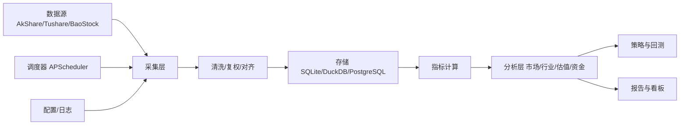

可以。建议你先做一个“能跑通 MVP”的 A 股金融信息分析框架：先实现 **数据采集 → 清洗存储 → 指标计算 → 市场/个股分析 → 报告/看板**，后面再加策略回测和组合管理。

推荐技术栈：

- 语言：Python 3.11+
- 数据处理：pandas / polars / numpy
- 数据源：AkShare 起步，Tushare Pro / BaoStock 备用
- 存储：SQLite 或 DuckDB + Parquet 起步，后期 PostgreSQL / ClickHouse
- ORM/查询：SQLAlchemy
- CLI：Typer + Rich
- 调度：APScheduler
- 可视化：Plotly + Streamlit
- 回测：backtrader / vectorbt / qlib，后期选型
- 配置：YAML + .env
- 测试：pytest

---

## 推荐目录结构

```text
ashare-insight/
├── README.md
├── requirements.txt
├── pyproject.toml
├── .env.example
├── .gitignore
├── config/
│   ├── settings.yaml
│   └── logging.yaml
├── data/
│   ├── raw/                 # 原始数据
│   ├── processed/           # 清洗后数据
│   ├── cache/               # 接口缓存
│   └── db/                  # SQLite / DuckDB
├── src/
│   └── ashare/
│       ├── __init__.py
│       ├── config.py
│       ├── logging.py
│       ├── cli.py
│       ├── scheduler.py
│       ├── data/
│       │   ├── sources/
│       │   │   ├── akshare_source.py
│       │   │   ├── tushare_source.py
│       │   │   └── baostock_source.py
│       │   ├── collectors.py
│       │   ├── cleaners.py
│       │   ├── storage.py
│       │   └── models.py
│       ├── indicators/
│       │   ├── trend.py
│       │   ├── momentum.py
│       │   ├── volatility.py
│       │   └── volume.py
│       ├── analysis/
│       │   ├── market_overview.py
│       │   ├── sector_rotation.py
│       │   ├── valuation.py
│       │   ├── fund_flow.py
│       │   └── sentiment.py
│       ├── strategy/
│       │   ├── base.py
│       │   ├── signals.py
│       │   └── backtest.py
│       ├── portfolio/
│       │   ├── position.py
│       │   ├── risk.py
│       │   └── performance.py
│       └── report/
│           ├── charts.py
│           ├── html.py
│           └── templates/
├── dashboard/
│   └── app.py
├── notebooks/
├── scripts/
├── tests/
└── docs/
```

核心模块职责：

- `data/sources`：封装 AkShare、Tushare、BaoStock，统一返回 DataFrame。
- `data/cleaners`：处理复权、停牌、涨跌停、字段标准化、日期对齐。
- `data/storage`：写入 SQLite / DuckDB / Parquet，提供查询接口。
- `indicators`：MA、EMA、MACD、RSI、BOLL、ATR、KDJ、成交量指标。
- `analysis`：市场概览、行业轮动、估值分位、资金流向、情绪指标。
- `strategy`：信号生成、回测、绩效评估。
- `portfolio`：持仓、风险、收益归因。
- `report/dashboard`：Plotly 图表、HTML 报告、Streamlit 看板。
- `scheduler`：每日收盘后自动更新数据、计算指标、生成报告。

---

## README.md 模板

你可以直接复制下面内容到 `README.md`，然后按需修改：

````markdown
# A-Share Insight

> 面向 A 股的金融信息采集、指标计算、市场分析与策略回测框架。

## 简介

A-Share Insight 是一个 Python 项目，用于采集 A 股行情、基本面、资金流和板块数据，计算常用技术指标，生成市场概览、个股分析、行业轮动和策略回测报告。

项目目标：

- 统一管理 A 股数据源
- 建立可复用的数据清洗与存储流程
- 提供常用技术指标和基本面分析
- 支持简单策略回测
- 通过 Streamlit 生成可视化看板
- 支持定时更新，形成每日市场报告

> 免责声明：本项目仅用于学习、研究和信息整理，不构成任何投资建议。

## 功能规划

- [ ] 股票基础信息、交易日历
- [ ] 日线、周线、月线行情
- [ ] 前复权、后复权处理
- [ ] 指数、行业、概念板块数据
- [ ] 基本面与估值指标
- [ ] 北向资金、主力资金、龙虎榜
- [ ] 技术指标：MA、EMA、MACD、RSI、BOLL、ATR、KDJ
- [ ] 市场概览：涨跌分布、成交额、涨停跌停
- [ ] 行业轮动与板块强弱
- [ ] 策略信号与回测
- [ ] Streamlit 可视化看板
- [ ] 每日定时任务与报告生成

## 架构



## 目录结构

```text
ashare-insight/
├── config/              # 配置文件
├── data/                # 数据目录
├── src/ashare/          # 核心代码
│   ├── data/            # 数据采集、清洗、存储
│   ├── indicators/      # 技术指标
│   ├── analysis/        # 市场分析
│   ├── strategy/        # 策略与回测
│   ├── portfolio/       # 组合与风险
│   └── report/          # 报告与图表
├── dashboard/           # Streamlit 看板
├── notebooks/           # 研究笔记
├── scripts/             # 一次性脚本
├── tests/               # 测试
└── docs/                # 文档
```

## 快速开始

### 1. 创建环境

```bash
python -m venv .venv

# Windows
.venv\Scripts\activate

# macOS / Linux
source .venv/bin/activate
```

### 2. 安装依赖

```bash
pip install -r requirements.txt
```

### 3. 配置环境变量

```bash
cp .env.example .env
```

`.env.example`：

```env
TUSHARE_TOKEN=
```

### 4. 修改配置

`config/settings.yaml`：

```yaml
data:
  source: akshare
  start_date: "2018-01-01"
  adjust: qfq
  cache_dir: data/cache

database:
  url: sqlite:///data/db/ashare.db

report:
  output_dir: data/reports
```

### 5. 初始化数据库

```bash
python -m ashare.cli init-db
```

### 6. 采集数据

```bash
python -m ashare.cli collect --symbols 600519,000001 --start 2020-01-01
```

### 7. 计算指标

```bash
python -m ashare.cli indicators --symbol 600519
```

### 8. 生成报告

```bash
python -m ashare.cli report --date today
```

### 9. 启动看板

```bash
streamlit run dashboard/app.py
```

## 核心数据表建议

- `stock_basic`：股票基础信息
- `trade_calendar`：交易日历
- `daily_price`：日线行情
- `daily_basic`：每日估值指标
- `financial_indicator`：财务指标
- `index_daily`：指数行情
- `sector_daily`：行业/概念板块行情
- `money_flow`：资金流向
- `factor_daily`：因子数据
- `signals`：策略信号
- `backtest_result`：回测结果

## A 股特殊性处理

- 复权：前复权、后复权、不复权要区分
- 停牌：停牌期间不能交易
- 涨跌停：回测时需判断是否可成交
- T+1：当日买入次日才能卖出
- 交易成本：佣金、印花税、过户费、滑点
- 财报披露：避免使用未来数据
- 指数成分：注意历史成分变化
- ST、退市、新股：需要单独过滤或标记

## 开发路线

### Phase 1：MVP

- AkShare 日线采集
- SQLite 存储
- MA、MACD、RSI 指标
- Streamlit 个股详情页
- 每日收盘后更新

### Phase 2：分析增强

- 行业轮动
- 估值分位
- 资金流向
- 市场情绪
- HTML 日报

### Phase 3：策略与回测

- 均线策略
- 动量策略
- 多因子选股
- 回测绩效：年化收益、最大回撤、夏普比率

### Phase 4：工程化

- PostgreSQL / ClickHouse
- Prefect / Airflow 调度
- FastAPI 接口
- 权限与部署

## 风险提示

本项目仅用于技术学习和研究。金融市场存在风险，历史数据不代表未来表现。任何策略回测结果都可能受到数据质量、滑点、交易成本、幸存者偏差等因素影响。请勿直接用于实盘投资。

## License

MIT
````

---

## 建议你先落地的文件

先写这几个就够跑 MVP：

```text
requirements.txt
config/settings.yaml
.env.example
src/ashare/cli.py
src/ashare/config.py
src/ashare/data/sources/akshare_source.py
src/ashare/data/storage.py
src/ashare/indicators/trend.py
dashboard/app.py
```

`requirements.txt` 可以先这样：

```text
akshare
pandas
numpy
polars
duckdb
sqlalchemy
pyyaml
python-dotenv
typer
rich
plotly
streamlit
apscheduler
pytest
```

下一步我建议直接生成：`requirements.txt`、`settings.yaml`、`cli.py`、`akshare_source.py`、`storage.py` 的初始代码。你可以告诉我你更想用 **AkShare + SQLite + Streamlit**，还是 **Tushare + DuckDB + FastAPI**。